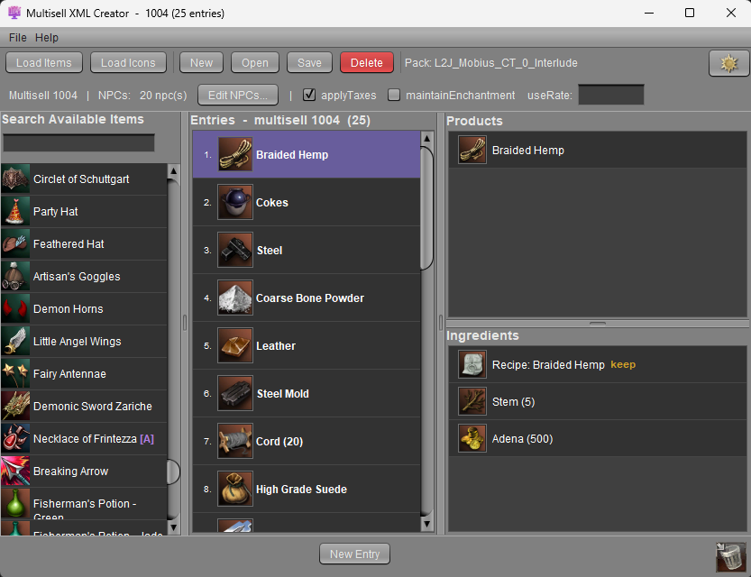
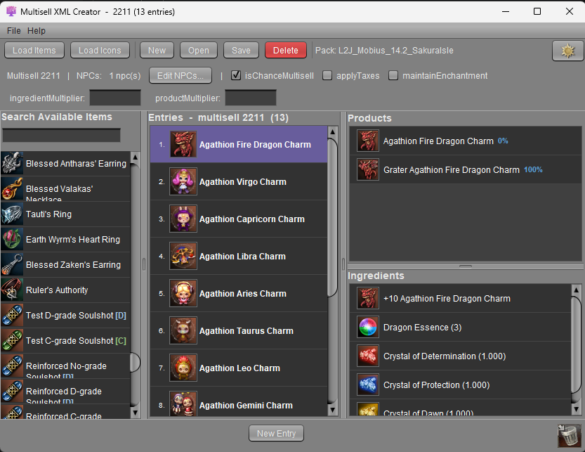
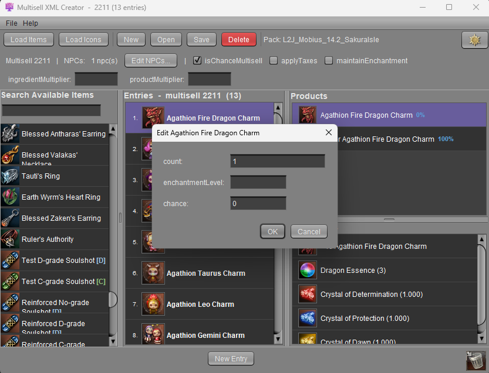
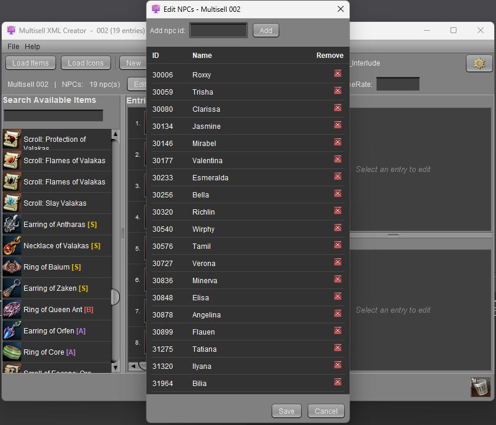
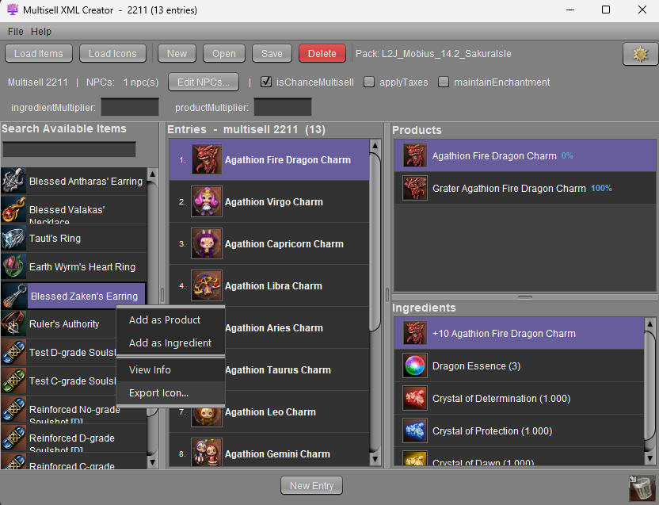

# Multisell XML Creator

**Build L2J Mobius multisell XML from a live datapack - visually, with real item icons, no hand-editing.**

Point it at your server files, then your client files - that's the whole setup. It lists
every item with its in-game icon; you drag them into trades and it writes clean,
server-ready `multisell/<id>.xml` in the exact style your Mobius branch expects.

<table>
<tr>
<td></td>
<td></td>
</tr>
</table>

## What it does

- **Dead simple** - point it at your server files, point it at your client files. That's it.
- **Every Mobius chronicle** - C1 through the latest, one tool.
- **New or edit** - start a multisell from scratch or open an existing one and reshape it, your way.
- **All your items in one place** - retail or custom, every item in one searchable list with
  its icon - something you can't even see all together in-game. Most icons show out of the box;
  **Load Icons** pulls the rest from your client.
- **Simple UI** - drag and drop to build trades, drag to reorder, right-click for the rest.
- **Export icons** - save any item's icon as a PNG.
- **Clean output** - tidy, server-ready XML; every item and NPC line commented with its name.
- **The UI adapts to your server** - it reads your datapack's own rules and shows only the
  options your branch supports, so you can't make an invalid multisell.

## Download

Grab the latest `MultisellCreator.zip` from the
[Releases](https://github.com/Skache994/MultisellCreator/releases) page, unzip it, and
double-click **`MultisellCreator.vbs`**. (Java 25 must be installed.)

## How to use

1. **Load Items** - pick your server's `game` folder (or its `data` folder). Every item loads.
2. *(optional)* **Load Icons** - if some icons are missing, point at your Lineage 2 client
   and it pulls in the extra texture packages.
3. **New** or **Open** a multisell.
4. **New Entry**, then drag items into its ingredients / products (or right-click to add), set
   amounts, and pick the NPCs and options in the settings bar.
5. **Save** - enter the multisell id; it writes `data/multisell/<id>.xml` into the datapack.

Tips: right-click an item or entry to remove it, drag it onto the trash bin to delete, and
double-click a line to edit its count and options.

## Screenshots

<table>
<tr>
<td> Per-line editor - count, enchant, chance</td>
<td> NPC editor - ids resolved to names</td>
<td> Right-click - add, view, export icon</td>
</tr>
</table>

## Build from source

**In Eclipse:** right-click `build.xml` -> **Run As -> Ant Build**.

The build produces a single `MultisellCreator.zip` in a `release/` folder next to the project
(one level up). Unzip it and double-click `MultisellCreator.vbs` to run.

## Requirements

- Java 25 (to run)
- [Eclipse](https://www.eclipse.org/downloads/) (to build from source)

## Support

If this tool helped you:

## License

MIT - see [LICENSE](LICENSE).

## Disclaimer

Lineage 2 is a trademark of NCsoft. The bundled game icons and sounds are property of NCsoft
and are included for convenience only - they are not covered by this project's MIT license.
